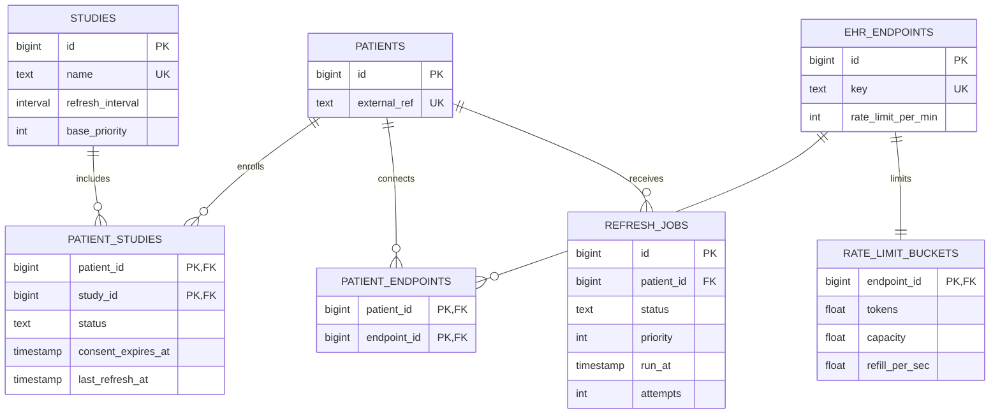

# Patient Data Refresh Orchestrator

## Introduction

The Patient Data Refresh Orchestrator schedules, executes, and tracks health-record refreshes for patients enrolled in studies. Study configuration determines when a patient needs a refresh, while each connected EHR endpoint has its own rate limit. The implementation includes a working job queue, PostgreSQL database, scheduler, multiple workers, retry handling, and a mock EHR API. Only the external EHR service is simulated.

The system addresses the core challenges described in the onsite packet: **Scheduling**, **Prioritization**, **Rate Limiting**, **Failure Handling**, **Distribution**, **Horizontal Scaling**, and **Cost**. It prevents duplicate work, handles urgent refreshes first, spreads work over time, respects endpoint rate limits, and combines multiple due study enrollments into one patient-level API call.

> **Important assumption — all-or-nothing endpoint capacity:** The packet supplies a patient-level API (`POST /patients/{id}/$updateData`), and the clarification response confirmed that one call refreshes the patient's connected EHRs while each endpoint's rate limit must still be respected. It did **not** explicitly require the orchestrator to wait until every connected endpoint has capacity, nor did it define endpoint-selective requests or partial-refresh results. This implementation therefore makes a conservative design choice: it reserves capacity from every endpoint associated with the patient before sending the call. If even one endpoint has no capacity, it sends no request, refreshes none of the endpoints, and retries the patient job later. We believe this is the safest interpretation because the supplied API cannot select only the available endpoints and the contract provides no way to track partial completion. A production implementation should confirm this behavior with the API owner.

## Architecture Design

```text
              +-------------+
              |  Admin API  |
              +------+------+
                     |
+-----------+   +----v-------+   +-------------+   +----------+
| Scheduler |-->| PostgreSQL |<--| Worker(s)   |-->| Mock EHR |
+-----------+   | jobs/state |   +-------------+   | API      |
                +------------+                     +----------+
```

- The scheduler determines which patients need a refresh, assigns priority, spreads jobs over time to avoid a sudden spike in traffic, and creates the jobs.
- PostgreSQL stores both the refresh jobs and their current state. It ensures that workers do not process the same job, and it keeps retry and rate-limit updates consistent.
- Workers safely claim the highest-priority available jobs without processing the same job twice. Each worker starts a new EHR refresh or checks the status of one already in progress, then records the result in PostgreSQL.
- The mock EHR simulates success, transient failure, permanent failure, and rate-limited responses.
- The admin API supports user-triggered refreshes and shows the current state of the system.

The main design decision was to use PostgreSQL as both the database and the job queue. This keeps job state, duplicate prevention, retries, and rate limiting in one place and makes the system easy to inspect. The tradeoff is that the shared rate-limit records could slow down job processing at a much larger scale. Jobs are created per patient because the supplied API refreshes all of a patient's connected EHR data with one call. With more time, I would improve how rate-limit capacity is shared across workers, prevent low-priority jobs from waiting too long, adjust polling based on EHR response time, and add more operational metrics. Further details are documented in [QuestionsAndClarifications.md](QuestionsAndClarifications.md).

## Schema Design

The schema contains seven tables and stores only the information the orchestrator needs. It does not store clinical records or FHIR resources.



`patient_studies` and `patient_endpoints` are relationship tables. They allow one patient to belong to several studies and connect to several EHR endpoints without duplicating the patient, study, or endpoint records. A patient can have many historical refresh jobs, but the database allows only one active job for that patient at a time.

### Why These Keys Were Chosen

A database key applies to one or more columns and gives each row a clear identity or relationship. The keys in this schema protect the rules the orchestrator depends on:

| Table and key | Key type | Reason for the choice |
|---|---|---|
| `patients.id` | Primary key | Gives each patient a small, stable internal ID that can be referenced efficiently by enrollments, endpoint connections, and jobs. |
| `patients.external_ref` | Unique key | This is the patient identifier sent to the EHR API. It must be unique so one external patient cannot map to two internal records. |
| `studies.id` | Primary key | Gives each study a stable ID even if its display name or configuration changes. |
| `studies.name` | Unique key | Prevents the same study from being created twice under the same business name. |
| `ehr_endpoints.id` | Primary key | Gives each EHR endpoint a stable ID for patient connections and rate-limit tracking. |
| `ehr_endpoints.key` | Unique key | Prevents duplicate endpoint definitions such as two separate `epic` records. |
| `patient_studies (patient_id, study_id)` | Composite primary key and foreign keys | The pair uniquely represents one patient's enrollment in one study. It prevents duplicate enrollments while still allowing a patient to join many studies and a study to include many patients. The foreign keys also prevent links to patients or studies that do not exist. |
| `patient_endpoints (patient_id, endpoint_id)` | Composite primary key and foreign keys | The pair uniquely represents one patient's connection to one EHR endpoint. It prevents duplicate connections and ensures both referenced records exist. |
| `rate_limit_buckets.endpoint_id` | Primary key and foreign key | Using the endpoint ID as both keys enforces one rate-limit record per EHR endpoint and ties that request budget directly to a valid endpoint. |
| `refresh_jobs.id` | Primary key | Gives every refresh attempt its own permanent identity for worker coordination, retries, status checks, and history. |
| `refresh_jobs.patient_id` | Foreign key | Connects every job to a valid patient and makes it possible to find that patient's current and historical refreshes. |

In addition to these keys, `refresh_jobs` has a database rule that allows only one `pending` or `in_progress` job per patient. Completed and failed jobs remain as history, while duplicate active work is rejected.

### What Is Stored

| Table | Key data stored | Why it is needed |
|---|---|---|
| `patients` | Patient ID and external reference | Identifies the patient in the refresh API. |
| `studies` | Name, refresh frequency, and base priority | Determines when enrolled patients are due and how urgent their jobs are. |
| `patient_studies` | Patient ID, study ID, enrollment status, consent expiration, and last refresh time | Connects patients to studies and drives refresh eligibility. |
| `ehr_endpoints` | Endpoint name and requests allowed per minute | Defines each EHR system and its rate limit. |
| `patient_endpoints` | Patient ID and endpoint ID | Identifies which endpoint rate limits must be respected for each patient. |
| `refresh_jobs` | Patient ID, status, priority, scheduled time, retry attempts, worker ownership, external request ID, and failure details | Stores the complete lifecycle of each refresh job. |
| `rate_limit_buckets` | Endpoint ID, available requests, maximum capacity, and refill rate | Tracks how much request capacity remains for each endpoint. |

### Example Data Across the Tables

The following simplified rows use the demo seed data. Follow patient IDs `15` and `42` through each table to see how the records connect.

#### 1. Patients

The `patients` table stores one row per patient. `external_ref` is the identifier sent to the EHR API.

| Patient ID | External reference |
|---:|---|
| 15 | `pat-0015` |
| 42 | `pat-0042` |

#### 2. Studies and Enrollments

The `studies` table defines how often data is refreshed and the starting priority for jobs created for that study.

| Study ID | Study name | Refresh frequency | Base priority |
|---:|---|---|---:|
| 1 | `cardiology-longitudinal` | 1 day | 100 |
| 2 | `oncology-weekly-panel` | 7 days | 120 |
| 3 | `acute-monitoring` | 2 minutes | 200 |

The `patient_studies` table connects patients to studies. It also stores the information used to determine whether that enrollment is due for a refresh.

| Patient ID | Study ID | Status | Last refreshed |
|---:|---:|---|---|
| 15 | 1 | `active` | Not yet refreshed |
| 15 | 2 | `active` | Not yet refreshed |
| 15 | 3 | `active` | Not yet refreshed |
| 42 | 1 | `active` | Not yet refreshed |
| 42 | 2 | `active` | Not yet refreshed |

This shows that patient 15 belongs to all three studies. Patient 42 belongs to the daily cardiology study and the weekly oncology study.

#### 3. EHR Endpoints and Patient Connections

The `ehr_endpoints` table defines each external system and its request limit.

| Endpoint ID | Endpoint | Requests per minute |
|---:|---|---:|
| 1 | `epic` | 100 |
| 2 | `cerner` | 30 |
| 3 | `regional-northwest` | 30 |

The `patient_endpoints` table shows which EHR systems hold data for each patient.

| Patient ID | Endpoint ID |
|---:|---:|
| 15 | 1 |
| 42 | 1 |
| 42 | 2 |
| 42 | 3 |

Patient 15 is connected only to Epic. Patient 42 is connected to Epic, Cerner, and Regional Health NW, so all three rate limits apply when patient 42 is refreshed.

#### 4. Rate-Limit Capacity

Each EHR endpoint has one `rate_limit_buckets` row. The example shows each endpoint starting with one minute of request capacity available.

| Endpoint ID | Requests available | Maximum capacity | Requests restored per second |
|---:|---:|---:|---:|
| 1 | 100 | 100 | 1.67 |
| 2 | 30 | 30 | 0.50 |
| 3 | 30 | 30 | 0.50 |

Before starting a refresh for patient 42, the system checks that all three endpoint rows have capacity. It then subtracts one request from each row as part of the same operation.

#### 5. Jobs Created by the Scheduler

When multiple studies are due for the same patient, the scheduler creates one patient-level job rather than one job per study. The database assigns the job ID at runtime, so it is omitted from this example.

| Patient ID | Due study IDs stored in job | Status | Priority | Attempts |
|---:|---|---|---:|---:|
| 15 | `{1,2,3}` | `pending` | 200 | 0 |
| 42 | `{1,2}` | `pending` | 120 | 0 |

Patient 15 receives one job with priority 200 because `acute-monitoring` is the highest-priority due study. Patient 42 also receives one job, but it cannot begin unless Epic, Cerner, and Regional Health NW all have available request capacity. When a refresh succeeds, `last_refresh_at` is updated for every active `patient_studies` row belonging to that patient.

In short, the relationship path for patient 42 is:

```text
patients (42)
  -> patient_studies -> studies (1 and 2)
  -> patient_endpoints -> ehr_endpoints (1, 2, and 3)
  -> refresh_jobs -> one combined job for due studies {1,2}
```

The complete schema, including constraints and indexes, is in [`db/schema.sql`](db/schema.sql).

## How to Run the Demo

### Prerequisites

- Docker with Docker Compose
- Node.js 22 or later
- npm

Run all commands from the repository root.

### Option 1: Run the Guided Demo

This is the recommended way to review the submission. PostgreSQL runs in Docker, while the demo script runs the scheduler, mock EHR, and four workers locally.

1. Start PostgreSQL:

   ```bash
   docker compose up -d postgres
   ```

2. Install the Node.js dependencies:

   ```bash
   npm install
   ```

3. Run the demo:

   ```bash
   npm run demo
   ```

The demo resets and seeds the local `healthex` database, then prints four stages:

1. Seeded patients, studies, enrollments, and EHR endpoints.
2. Due patients scheduled in priority order, with multiple studies combined into one patient job.
3. Four workers processing jobs while observing endpoint rate limits, followed by the queue draining after limits are lifted.
4. Database-backed checks for retries, permanent failures, duplicate prevention, **Horizontal Scaling**, and avoided API calls.

> **Warning:** `npm run demo` drops and recreates the tables in the configured database. Use the default local `healthex` database and do not point `DATABASE_URL` at a database containing data you need to keep.

### Option 2: Run the Entire System with Docker

Build the application image and start PostgreSQL, the mock EHR, the scheduler/admin API, and the worker containers:

```bash
docker compose up --build
```

Keep this terminal open to watch jobs being scheduled, claimed, and processed. The services are exposed at:

| Service | Address |
|---|---|
| Admin API | `http://localhost:4000` |
| Mock EHR | `http://localhost:4010` |
| PostgreSQL | `localhost:5432` |

In a second terminal, check the running containers and application state:

```bash
docker compose ps
curl http://localhost:4000/stats
curl http://localhost:4000/due
```

To run four worker containers instead of the default two:

```bash
docker compose up --build --scale worker=4
```

### Run the Tests

The test suite uses a real PostgreSQL instance so it can verify worker coordination, duplicate prevention, priority order, and **Rate Limiting** using the same database behavior as the application.

1. Start PostgreSQL if it is not already running:

   ```bash
   docker compose up -d postgres
   ```

2. Install dependencies if needed:

   ```bash
   npm install
   ```

3. Run the complete test suite:

   ```bash
   npm test
   ```

The test setup automatically creates the local `healthex_test` database when it is missing. It resets that test database between test cases; it does not use the demo's `healthex` database.

For watch mode during development:

```bash
npm run test:watch
```

To verify TypeScript without running the tests:

```bash
npm run typecheck
```

### Stop the Services

Stop and remove the containers when finished:

```bash
docker compose down
```
